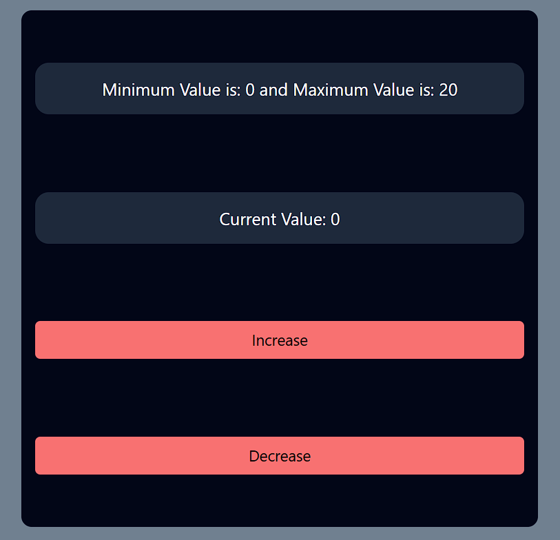
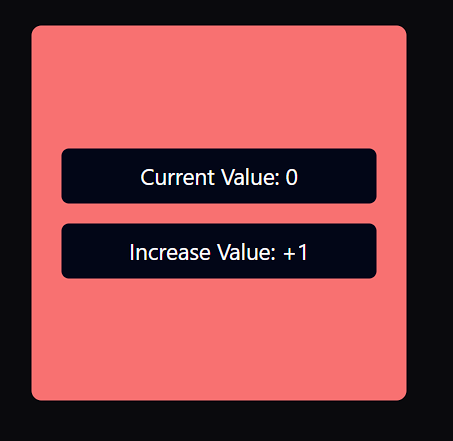
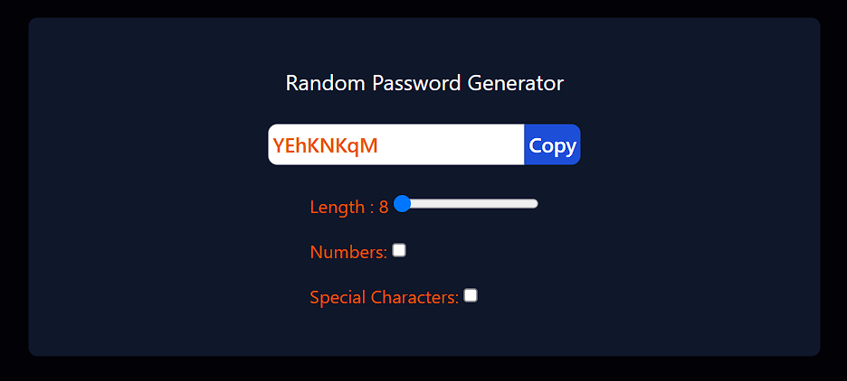
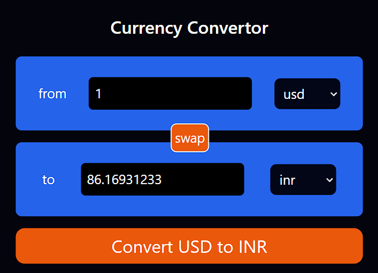

# My React Projects 🥳

<u>**Repo Aim:**</u> To become more efficient in **React JS** along with **Redux Toolkit** and all necessary **Third Party Libraries** that is needed for basic project development.

Every project has its own **readme.md** file where I will describe the project approach and problems I faced while development and all the lessons that I learn't while debugging my code.

For styling purpose I will be using **Tailwind CSS** and YES !, I will be focusing on UI in order to make projects **Responsive** which is the main actual concern of the projects.

This **readme.md** file will contain all the topics that I am first learning before creating a project and all the **theoretical concepts** related to **React** like _JSX, props, lifting-state-up, prop-drilling, virtual dom, reconciliation, fibre algorithm, rendering of JSX and much more_.

> Before learing React, make sure that you know HTML, CSS and YES!, YES!, YES!, good knowledge of **Javascript** is a must to learn React fast or else you will keep struggling at every line of code.

> **Set UP :** VS Code, Internet Connection, node js must be installed. To check for node js, just type **node --version** in command prompt and must show some output if not then install it.

## How to Create a React Project

> To create a react project use **vite** because it is lightweight and fast. <br/> [SetUp Guide to Create a React App With Vite](https://v3.vitejs.dev/guide/)

> Try to understand **package.json** file. It will guide you how to study your project and how you can start it and necessary **dependencies** and **devdependencies** of your project. [Take a Look Here](https://www.geeksforgeeks.org/beginners-guide-to-package-json/)

## How to Set Up Tailwind CSS With Vite

> [Follow The Documentation](https://tailwindcss.com/docs/guides/vite). Start from step 2 as you have already created a project in avove step with vite.

## React Hooks Tutorial

Hooks in react are used to managed states in the UI. See, the job of updating UI is totally controlled by React. React provides us with hooks through which we can tell React that I want to update something in UI and then React will be responsible to trigger the updates.

See, the main concept of React is that, I as a developer will not control or update DOM directly. React is the middle-man through which I will be able to change or manipulate DOM. However, the catch is React will trigger the DOM if it finds that there is some change in the state or else it will discard the updates.

> **What is a JSX ?** <br/>
> JSX is Javascript XML. Basically, it helps you write Javascript and HTML together.

> **What is a Component ?** <br/>
> A component in react is nothing but a function like we have in Javascript. But along with Javascript we also have HTML in these functions. The extension therefore is **. JSX**.

> **Important Note:** You can use file extensons as **. JSX** or **. js** while developing React applications using Javascript but it is recommended that if the file is purely a JS file then only write **. js** or else wherever using JSX it is better to use **. JSX**. The name of the rect components should be always begin with **Capital Letter** because it is preffered. Below is an example of **Component With JSX**. Also, take a look how the functional components are **invoked** and they must be invoked in similar way.

```JSX
import React from 'react';
import ReactDOM from 'react-dom';

function App() {
  return <h1>Hello, World!</h1>;
}

ReactDOM.render(<App />, document.getElementById('root'));

```

> **What is a state ?** <br/>
> Yes!, it willl be very confusing for beginners and often they confuse it with **props**. However, things are different and they are not the same. State in react are objects or you can think it like a storage place for dynamic variables. Means that they tend to change at some point. It helps react to understand change and then react triggers the change in the component and then it is reflected in the UI. Important, state are like variables and not exactly variables.

> **What are props ?** <br/>
> Props is short for "properties". It is a readonly object and it is used to pass data from a parent component to child component. This helps us with component reusability and allows dynamic values to be passed and accessed within the child component. The data flow in react is unidirectional it means that only top level component can pass data to lower level components and the reverse is not allowed.

> **What are key props?** <br/>
> When you try to render similar type of items using map() method then each item should be assigned a **key prop**. Not passing a key prop will highly degrade the performance. The **key prop** should be unique so that react could differentiate between those similar kinds of generated element. You can use **array index** as key prop, but it is **not recommended**. Explore on chatGPT why is it so??🔍

### 1. useState Hook in React

In order to understand **useState** hook take a look at 02_useStateProject. You will understand all the key concepts of this hook. This is the first and the most basic hook that you will find in any tutorial.

### 2. useEffect Hook, useRef Hook and useCallback Hook in React

In order to understand all these 3 hooks take a look at markdown file of project 03_passwordGenerator. There are actually a lot more things in those hooks and they may be confusing initially. Consider exploring documentation and reading quite a few articles to understand the actual use case of these 3 hooks.

### 3. useId Hook and Custom Hooks in React
To understand these hooks take a loot at the project 04_currencyConvertor. Hooks that are created by user which includes **made up react hooks** are known as **custom hooks**. And they are also functions in javascript. A hook's name must start with the word **use...**. So any function which has **use** as their prefix is known as hook.

The **useId** hook is basically used to link **label and input** in my project. It does not have that much implementation.

> Do NOT useId() to generate unique keys because React says it.

## Project List

### 01 Counter Project

A simple counter project where user can increase counter value by 1. The minimum value is 0 and the maximum vaue is 20.


### 02 useStete Project

This project demonstrates the working of the useState hook in react to get all details take a look into the counter component of this project and its specific markdown file.


### 03 Password Generator Project

This is a project that is used to generate a random password of specified length. User can choose whether to include number and special characters in the password or not. It also has a copy to clipboard button and the copied text is highlighted with the use of useRef hook.


### 04 Currency Convertor Using API

This is a simple currency convertor project which fetches data from external source api and then populates the change on users demand on user based interaction. It also has a swap functionality where user can instantly switch between **to and from**.

